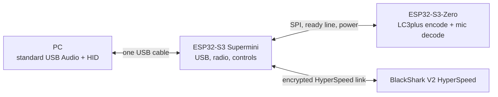

# Open ULL Receiver

### Two tiny ESP32-S3 boards, one USB cable, and a headset that refused to become e-waste.

This is an **unofficial, experimental replacement receiver** for the Razer BlackShark V2 HyperSpeed. On our tested headset, it now provides native USB stereo playback, mono microphone input, the mic-mute switch, volume-wheel keys, short-press play/pause, and automatic wireless reconnection. An unmodified Linux PC sees a standard USB audio and HID device. The same USB interfaces should be usable by other hosts, though our end-to-end testing has been on Linux.

The receiver is a stack of an **ESP32-S3 Supermini** and an **ESP32-S3-Zero with PSRAM**. The Supermini faces the PC and handles USB, radio, and controls; the Zero handles the codec work over SPI. Once flashed and wired, only the Supermini needs a USB cable.

> **The important limit:** this is source for a working *paired* prototype, not a universal pairing tool. You need your own headset's existing HyperSpeed bond and receiver identity from a readable original-dongle dump or an earlier private backup. If the original receiver is gone and no dump exists, fresh pairing is not implemented here. Ordinary Bluetooth pairing will not replace the HyperSpeed bond.

## How we got here

At first, this looked like one of those maddening Linux audio problems. The original dongle would disappear, the headset would stop playing, and the temptation was to write a driver or blame USB power management. Then Windows called the very same receiver an **Unknown USB Device** with descriptor failure **Code 43 / 0000002B**. Razer's updater could not see it either. The failure happened before either operating system could load an audio driver.

We opened the receiver. The PCB looked fine under magnification, but squeezing near its main Airoha chip while plugging it in could bring it back to life. Sometimes it stayed up long enough to play real PC audio; sometimes a gentle nudge ended the session. That pointed to a physical connection fault hidden under the chip, not a Linux-only software bug. We kept the original alive just long enough to collect the owner-specific information needed for a replacement.

The replacement began with a deceptively simple question: could an ESP32 speak the headset's **HyperSpeed** link? The headset also has regular Bluetooth, but that path was never the goal; Bluetooth hands-free audio would have missed the point. Early radio experiments produced green LEDs and convincing connection prompts, yet **a green LED was not audio**. The first unmistakable milestone was a four-note C–E–G–C cue heard through the headset from the S3. The first live USB audio sounded more like a distant, damaged radio than music. It took frame timing, codec work, RF hopping, USB clock feedback, and a lot of listening to turn that into recognizable, then mostly clean playback.

One S3 could do the job in bursts, but the reference LC3plus encoder and microphone decoder competed for a brutal 5 ms frame deadline. Rather than hope a single tiny board would somehow get faster, we split the work: the Zero handles encoding and decoding with PSRAM; the Supermini keeps the USB and radio schedule. That produced simultaneous stereo playback and a usable microphone. We then tied the boards' 5 V and ground rails so **one Supermini USB connection** powers the finished stack.

The final nuisance was subtle. Repeating audio packets made playback cleaner, but repeating every control-bearing packet made the wheel feel as though its clicks were being delivered from a queue several seconds in the past. The current scheduler keeps the audio retry while reserving one control poll every 120 ms as a single-send opening; after a real headset control reply, it holds control polls to single-send for five seconds. The user confirmed that audio and controls now work well together. This is still radio engineering, not a promise of zero glitches: a 15-second live check completed all 3,003 audio frames with no local USB, SPI, playback, or mic drops, while five frames had no confirmed stereo radio acknowledgement. A missing acknowledgement does not by itself prove that audio was lost.

## What runs where



The host sees stereo 48 kHz/16-bit output, mono 48 kHz/16-bit input, and HID consumer controls. The Zero encodes playback into 96 kHz LC3plus HR frames and decodes microphone frames. The radio side sends 5 ms wireless audio frames. See [the architecture and exact wiring](docs/architecture.md) for pin assignments and scheduling details.

## Build your own

1. Obtain the official [ETSI TS 103 634 V1.7.1 LC3plus attachment](https://www.etsi.org/deliver/etsi_ts/103600_103699/103634/01.07.01_60/) and extract it **locally**. The reference codec is not in this repository. Install it and pinned TinyUSB with:

   ```sh
   python3 tools/setup_dependencies.py --lc3plus-dir /path/to/extracted/LC3plus
   ```

2. If **your own original receiver** is still recognized as `1532:0565` with the supported diagnostic firmware, make a read-only dump **outside this checkout**. An earlier private dump can be used instead.

   ```sh
   python3 tools/dump_original.py --out /private/path/original-flash.bin
   python3 tools/provision_from_dump.py inspect --flash /private/path/original-flash.bin
   ```

   Multiple historical bond records can exist. The tool reports candidates but cannot choose the active one for you. After identifying your record offsets, generate local, Git-ignored headers:

   ```sh
   python3 tools/provision_from_dump.py generate \
     --flash /private/path/original-flash.bin \
     --bond-offset 0xYOUR_OFFSET \
     --sirk-offset 0xYOUR_OFFSET \
     --receiver-offset 0xYOUR_OFFSET
   ```

3. Build with PlatformIO and the pinned `espressif32@6.12.0` platform:

   ```sh
   pio run -d firmware/codec
   pio run -d firmware/radio
   ```

4. Read the [wiring and flashing guide](docs/build.md) before connecting power or uploading. The boards share **5 V and GND** in the finished one-cable stack; while those rails are tied, plug in **only one board's USB port at a time**. Flash the Zero and Supermini separately, then use only the Supermini USB port in normal operation.

For a running receiver, [read-only diagnostics](docs/diagnostics.md) can separate local deadline/queue problems from missing radio acknowledgements. The build is tied to tested ESP32-S3 variants and version-sensitive controller hooks. A different board or toolchain needs its own validation.

## What is — and is not — published

- `firmware/radio`: the USB Audio Class 2/HID device, control link, radio transport, retries, and reconnection logic.
- `firmware/codec`: the SPI-connected stereo encoder and mono decoder application.
- `tools`: owner-run dump/provisioning helpers, dependency setup, release audit, and payload-free diagnostics.
- `patches`: adaptations to the separately obtained ETSI LC3plus reference source.
- `tests`: host-side checks for the control-link state machine.

No Razer firmware, decompiled vendor source, original-dongle dump, packet or audio capture, pairing secret, or precompiled owner-specific image is included. The application code we wrote is MIT-licensed; the external codec and its adaptation patch have their own terms. See [publication and license scope](docs/publication-scope.md). The prototype uses a development USB VID/PID, not Razer's.

This project exists because a hardware failure did not have to end the headset's useful life. It is independent work and is not affiliated with or endorsed by Razer. Razer and BlackShark are trademarks of their respective owner.
